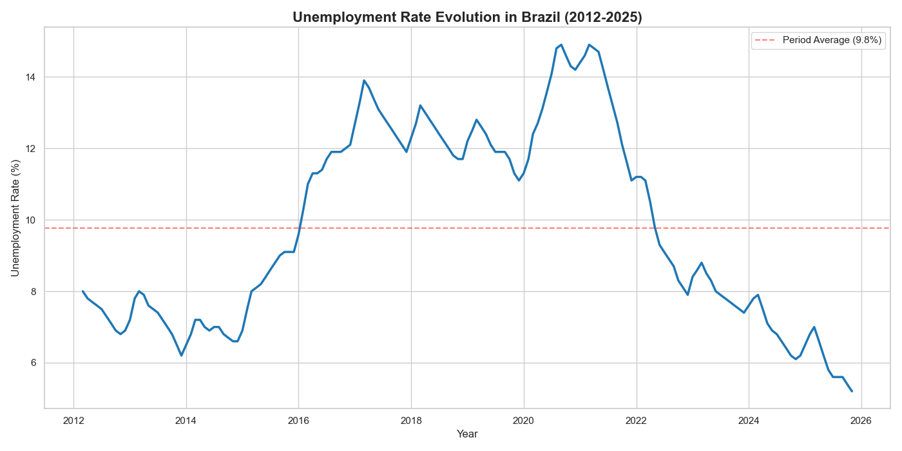

# Brazil Unemployment Analysis 🇧🇷


*(Evolution of unemployment rate in Brazil based on IBGE PNAD Contínua data)*

## 📊 Project Overview
This project analyzes unemployment data in Brazil using official public datasets. The goal is to explore trends and historical behavior of unemployment rates through automated data collection and analysis.

**Key Findings:**
- **Economic Crisis (2015-2017):** Unemployment surged from ~6.5% to a peak of over 13%.
- **Pandemic Impact (2020-2021):** A second major spike occurred due to COVID-19, reaching nearly 15%.
- **Current Recovery:** Since 2022, there has been a consistent downward trend, reaching historical lows (~5-6%) in 2025.

## 🎯 Objectives
- Automated data collection via API (IBGE SIDRA).
- Data cleaning and transformation (ETL).
- Time series visualization and interpretation.
- Practice data analysis skills using real-world public data.

## 🗂️ Data Source
The data is officially sourced from **IBGE (Brazilian Institute of Geography and Statistics)** via the **PNAD Contínua** survey using their public API (SIDRA).

## 🛠️ Technologies
- **Language:** Python
- **Data Manipulation:** Pandas
- **Visualization:** Matplotlib, Seaborn
- **Development:** Jupyter Notebook
- **Version Control:** Git & GitHub

## 📁 Project Structure
```text
brazil-unemployment-analysis/
├── data/
│   ├── raw/       # Raw CSV files from API
│   └── ...        # Generated charts/images
├── notebooks/
│   ├── 01_data_collection.ipynb    # API consumption script
│   └── 02_exploratory_analysis.ipynb # Data cleaning & visualization
├── src/           # Reusable code (future implementation)
└── README.md
